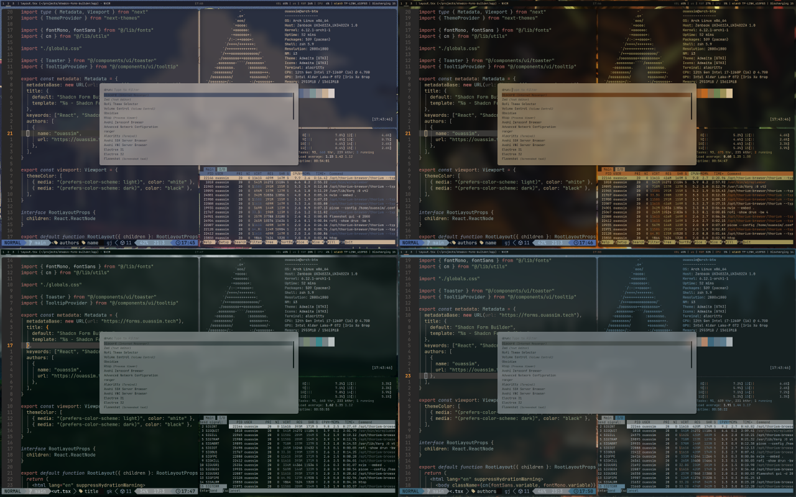

# Ouassim’s dotfiles

**Warning**: Don’t blindly use my settings unless you know what that entails.
Use at your own risk!

---

These are the dotfiles of my current arch-linux setup.

- Settings for:
  - [neovim](/nvim/.config/nvim) (text editor)
  - [zsh](./zsh/.zshrc) (shell)
  - [i3](./i3/.config/i3) (window manager)
  - [polybar](./polybar/.config/polybar) (status bar)
  - [alacritty](./alacritty.config/alacritty) (terminal)
  - [rofi](./rofi.config/rofi) (launcher)
  - [ranger](./ranger.config/ranger) (file manager)
  - [flameshot](./flameshot.config/flameshot) (screenshots)
  - [lazygit](./lazygit.config/lazygit) (tui for git)
  - [picom](./picom.config/picom) (compositor)
  - [tmux](./tmux.config/tmux) (terminal multiplexer)
  - [pywal](./wal.config/wal) (color palettes generator)
  - [git](./git.gitconfig) (git aliases, preferences...)

> I use [GNU Stow](https://www.gnu.org/software/stow/) to manage my dotfiles
> I wrote this [blog post](https://ouassim.tech/notes/how-i-use-gnu-stow-to-manage-my-dotfiles/) where I go through how I use GNU Stow, check it out!

## Wallpapers

- I maintain this
  [drive](https://drive.google.com/drive/folders/132dHpir75mrxXgc2TcMHT4aQYq63Mpti?usp=sharing)
  where I collect various wallpapers from around the web.
- [r/unixporn](https://www.reddit.com/r/unixporn/)
- [r/wallpapers](https://www.reddit.com/r/wallpapers)

## About me

- [Follow me on 𝕏](https://twitter.com/strlrd29)
- [ouassim.tech](https://www.ouassim.tech)
